<div align="center">
  <a href="https://github.com/zenpai6996/FlowState-Backend">
    
  </a>
</div>

<div align="center">
  <p>Robust, scalable, and secure backend API powering the FlowState project management platform.</p>
</div>

<div align="center">
  
  
  
  
  
</div>
<div align="center">
  <br>
  
  **[🚀 Live Demo](https://flowstate-omega.vercel.app/)** • 
  **[🐛 Report Bug](https://github.com/zenpai6996/FlowState-Backend/issues)** • 
  **[💡 Request Feature](https://github.com/zenpai6996/FlowState-Backend/issues)**
</div>


<div align="center">

  [](https://github.com/zenpai6996/FlowState-Frontend)

</div>

## ✨ Features

<div align="left">

### 🔐 Authentication & Security

| Feature | Description |
|---------|-------------|
| **🔑 JWT Authentication** | Secure token-based authentication system |
| **👤 User Management** | Complete user registration, login, and profile management |
| **🛡️ Role-Based Access** | Granular permissions for different user roles |
| **🔒 Password Security** | Bcrypt hashing with salt rounds |
| **⚡ Session Management** | Secure session handling and token refresh |

### 📊 Project Management API

| Feature | Description |
|---------|-------------|
| **🏗️ Project CRUD** | Complete project lifecycle management |
| **✅ Task Operations** | Create, update, assign, and track tasks |
| **👥 Team Management** | User invitation and team collaboration features |
| **📈 Progress Tracking** | Real-time progress calculation and metrics |
| **⏰ Deadline Tracking** | Automated deadline monitoring and notifications |

### 🔄 Real-Time Features

| Feature | Description |
|---------|-------------|
| **🔴 Live Updates** | WebSocket integration for real-time collaboration |
| **📢 Activity Feeds** | Track and broadcast project activities |
| **💬 Notifications** | In-app and email notification system |
| **🔄 Data Synchronization** | Real-time data sync across multiple clients |

### 🛠️ Advanced Capabilities

| Feature | Description |
|---------|-------------|
| **🔍 Advanced Search** | Full-text search across projects and tasks |
| **📊 Analytics API** | Comprehensive project and user analytics |
| **📧 Email Services** | Automated email notifications and invitations |

</div>

---

## 🛠️ Tech Stack

- **Runtime:** Node.js 18+ with TypeScript
- **Framework:** Express.js with async/await patterns
- **Database:** MongoDB with Mongoose ODM
- **Authentication:** JWT with refresh token strategy
- **File Storage:** Multer + Cloud Storage (AWS S3/Cloudinary)
- **Real-time:** Socket.io for WebSocket connections
- **Validation:** Zod for request validation
- **Security:** CORS, Rate Limiting
- **Email:** Nodemailer with template support

---

## 🏗️ Architecture Overview

```
FlowState-Backend/
├── controllers/           # Request handlers
│   ├── auth.controller.js
│   ├── project.controller.js
│   ├── task.controller.js
│   └── user.controller.js
├── libs/                  # Library files
├── middleware/            # Custom middleware (singular, not plural)
│   ├── auth.middleware.js
│   └── validation.middleware.js
├── models/               # Database models
│   ├── User.model.js
│   ├── Project.model.js
│   └── Task.model.js
├── node_modules/         # Dependencies
├── routes/               # API routes
│   ├── auth.routes.js
│   ├── projects.routes.js
│   └── tasks.routes.js
├── uploads/              # File uploads directory
├── .env                  # Environment variables
├── .gitignore           # Git ignore file
├── banner.svg           # Project banner
├── index.js             # Main entry point
├── LICENSE              # License file
├── package-lock.json    # Lock file
├── package.json         # Package configuration
└── README.md            # Documentation
```

---

## 🚀 Quick Start

### Prerequisites
- Node.js (v18 or higher)
- MongoDB (v5.0 or higher)
- npm or yarn package manager

### Installation

1. **Clone the repository**
   ```bash
   git clone https://github.com/zenpai6996/FlowState-Backend.git
   cd FlowState-Backend
   ```

2. **Install dependencies**
   ```bash
   npm install
   # or
   yarn install
   ```

3. **Set up environment variables**
   ```bash
   cp .env.example .env
   ```
   
   Update the `.env` file with your configuration:
   ```env
   # Server Configuration
   NODE_ENV=development
   PORT=5000
   
   # Database
   MONGODB_URI=mongodb://localhost:27017/flowstate
   
   # JWT Configuration
   JWT_SECRET=your-super-secret-jwt-key

   
   # Email Configuration (Optional)
   SMTP_HOST=smtp.gmail.com
   SMTP_PORT=587
   SMTP_USER=your-email@gmail.com
   SMTP_PASS=your-app-password
   
   # File Upload (Optional)
   CLOUDINARY_CLOUD_NAME=your-cloud-name
   CLOUDINARY_API_KEY=your-api-key
   CLOUDINARY_API_SECRET=your-api-secret
   
   # Client URL
   CLIENT_URL=http://localhost:5173
   ```

4. **Start MongoDB**
   ```bash
   # Using MongoDB service
   sudo systemctl start mongod
   
   # Or using Docker
   docker run -d -p 27017:27017 --name mongodb mongo:latest
   ```

5. **Run database migrations/seeders (if any)**
   ```bash
   npm run seed
   ```

6. **Start the development server**
   ```bash
   npm run dev
   # or
   yarn dev
   ```


---


## 🔒 Security Features

- **✅ Input Validation:** Comprehensive request validation
- **🔐 CORS Configuration:** Secure cross-origin resource sharing
- **🔑 JWT Security:** Secure token generation and validation
- **🚨 Error Handling:** Secure error responses without data leakage
- **📝 Request Logging:** Comprehensive logging for monitoring

---


## 🤝 Contributing

We welcome contributions! Please follow these steps:

1. Fork the repository
2. Create a feature branch (`git checkout -b feature/amazing-feature`)
3. Commit your changes (`git commit -m 'Add amazing feature'`)
4. Push to the branch (`git push origin feature/amazing-feature`)
5. Open a Pull Request


## 🐛 Known Issues

- [ ] WebSocket reconnection handling needs improvement
- [ ] File upload size optimization for large files
- [ ] Email queue processing for high-volume scenarios

---

## 📄 License

This project is licensed under the MIT License - see the [LICENSE](LICENSE) file for details.

---


<div align="center">
  <p>⭐ If you found this project helpful, please give it a star!</p>
  <p>Built with 💛  by Souharda</p>
  
</div>
